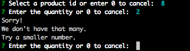

# Bamazon
Unfortunately, I only had time to complete ther minimun requirements.  Below is a copy of the instructions for that section along with screen shots and code and data snippets to show that I completed the instructions.


```
Challenge #1: Customer View (Minimum Requirement)


1. Create a MySQL Database called `bamazon`.
```

**I used  [bamazon-ddl.sql](./bamazon-ddl.sql) to create the database:**

```sql
DROP DATABASE IF EXISTS bamazon;

CREATE DATABASE bamazon;

...
```

2. Then create a Table inside of that database called `products`.

** I used  [bamazon-ddl.sql](./bamazon-ddl.sql) to create the products table:**

```sql
CREATE TABLE products (
item_id INT NOT NULL AUTO_INCREMENT,
product_name VARCHAR(100),
department_name VARCHAR(100),
price DECIMAL(10,2),
stock_quantity INT UNSIGNED,
PRIMARY KEY (item_id));
```
```
3. The products table should have each of the following columns:

   * item_id (unique id for each product)

   * product_name (Name of product)

   * department_name

   * price (cost to customer)

   * stock_quantity (how much of the product is available in stores)
```   
   
**See the response to 2.**   
```
4. Populate this database with around 10 different products. (i.e. Insert "mock" data rows into this database and table).
```

**I created [bamazon-data-init.sql](./bamazon-data-init.sql) to initialize the data.**

```
5. Then create a Node application called `bamazonCustomer.js`. Running this application will first display all of the items available for sale. Include the ids, names, and prices of products for sale.
```

** **
```
6. The app should then prompt users with two messages.

   * The first should ask them the ID of the product they would like to buy.
   * The second message should ask how many units of the product they would like to buy.
```
** Here is the happy path:**


```
7. Once the customer has placed the order, your application should check if your store has enough of the product to meet the customer's request.

   * If not, the app should log a phrase like `Insufficient quantity!`, and then prevent the order from going through.
```
**Insufficient Quantity Example:**



```
8. However, if your store _does_ have enough of the product, you should fulfill the customer's order.
   * This means updating the SQL database to reflect the remaining quantity.
   * Once the update goes through, show the customer the total cost of their purchase.
```

**This is demonstrated in the following screen shot (The initial quantity was 5 in this case)**


